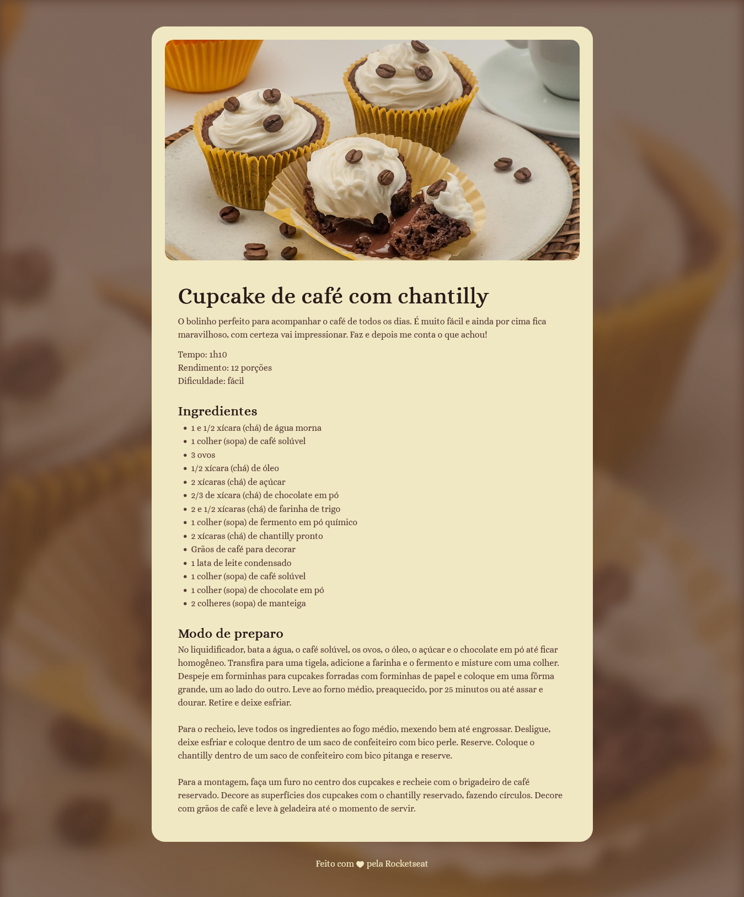

# Página de receita - Rocket Seat

Uma página de receita dedicada a um cupcake de café com chantilly, apresentando os ingredientes e o modo de preparo de forma organizada.

## Sumário:
- [Geral](#geral)
  - [Screenshot](#screenshot)
  - [Links](#-links)
- [Processo de criação](#processo-de-craicao)
  - [Feito com:](#feito-com)
  - [Aprendizado](#aprendizado)
- [Autor](#autor)

## Geral

### Screenshot



### 🔗 Links

- Solution URL: [https://github.com/FYLIPI-2004/Pagina-de-receita](https://github.com/FYLIPI-2004/Pagina-de-receita)
- Live Site URL: [https://fylipi-2004.github.io/Pagina-de-receita/](https://fylipi-2004.github.io/Pagina-de-receita/)

## Processo de criação

### Feito com:

- Semantic HTML5 markup
- CSS custom properties
- Flexbox

### Aprendizado

Utilização de `section`:
```
<section id="about">
        <h1>Cupcake de café com chantilly</h1>
        <p>O bolinho perfeito para acompanhar o café de todos os dias. É muito fácil e ainda por cima fica maravilhoso,
          com certeza vai impressionar. Faz e depois me conta o que achou!</p>

        <p>
          Tempo: 1h10<br>
          Rendimento: 12 porções<br>
          Dificuldade: fácil
        </p>
      </section>
```
## Autor

- [@FYLIPI-2004](https://github.com/FYLIPI-2004)
